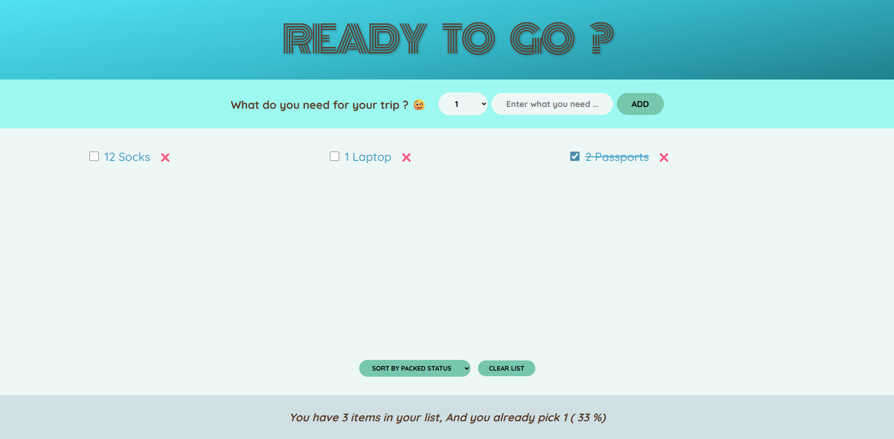

# 🧳 Travel Packing List

A beautiful and interactive travel packing list app built with React. Keep track of what you need to pack for your trips with an intuitive, user-friendly interface.


## ✨ Features

- **Add Items**: Create a packing list with custom quantities (1-20 items per entry)
- **Toggle Status**: Mark items as packed/unpacked with a simple checkbox
- **Smart Sorting**: Sort your list by input order, description, or packed status
- **Duplicate Prevention**: Automatically prevents adding duplicate items
- **Delete Items**: Remove individual items with confirmation
- **Clear All**: Clear the entire list with one click (with confirmation)
- **Progress Tracking**: See real-time statistics showing packed percentage
- **Responsive Design**: Works seamlessly on desktop, tablet, and mobile devices
- **Beautiful UI**: Modern gradient design with smooth hover effects

## 🚀 Live Demo

[https://travel-list-hermouch.vercel.app/](#) <!-- Add your deployed link here -->

## 📸 Screenshots



## 🛠️ Tech Stack

- **React 19.2.0** - Modern UI framework
- **React Hooks** - useState for state management
- **CSS3** - Custom styling with gradients and animations
- **Responsive Design** - Mobile-first approach with media queries

## 📦 Installation

1. Clone the repository:
```bash
git clone https://github.com/yourusername/travel-list.git
cd travel-list
```

2. Install dependencies:
```bash
npm install
```

3. Start the development server:
```bash
npm start
```

4. Open [http://localhost:3000](http://localhost:3000) in your browser

## 🎯 Usage

1. Enter the quantity of items you need (using the dropdown)
2. Type the item description in the input field
3. Click "Add" to add the item to your list
4. Check/uncheck items as you pack them
5. Sort items using the dropdown menu
6. Delete individual items using the ❌ button
7. Clear the entire list when finished

## 🔧 Available Scripts

In the project directory, you can run:

### `npm start`
Runs the app in development mode at [http://localhost:3000](http://localhost:3000)

### `npm test`
Launches the test runner in interactive watch mode

### `npm run build`
Builds the app for production to the `build` folder

### `npm run eject`
**Note: this is a one-way operation**

Ejects from Create React App to expose configuration files

## 🎨 Project Structure

```
travel-list/
├── public/
├── src/
│   ├── Components/
│   │   ├── Logo.js          # App header with gradient title
│   │   ├── Form.js          # Item input form
│   │   ├── PackingList.js   # List display with sorting
│   │   └── Stats.js         # Progress statistics
│   ├── App.js              # Main app component
│   ├── index.js            # Entry point
│   └── index.css           # Global styles
├── package.json
└── README.md
```

## 🎓 What I Learned

This project helped me practice:
- React functional components and hooks
- State management with useState
- Prop drilling between components
- Event handling and form validation
- Array manipulation (filter, map, sort)
- Responsive CSS design
- User experience considerations (confirmations, alerts)

## 🔮 Future Enhancements

- [ ] Add localStorage persistence
- [ ] Implement categories for different types of items
- [ ] Add edit functionality for existing items
- [ ] Create multiple packing lists (work trips, vacation, etc.)
- [ ] Add dark mode
- [ ] Export list as PDF or text file
- [ ] Add share functionality

## 🤝 Contributing

Contributions, issues, and feature requests are welcome! Feel free to check the issues page.

## 📝 License

This project is open source and available under the [MIT License](LICENSE).

## 👤 Author

**Hermouch Abdelmajid**
- GitHub: [@hermouchWeb](https://github.com/hermouchDev/Mini-Travel-List-App)
- LinkedIn: [https://www.linkedin.com/in/abdelmajid-hermouch/](#)

---

⭐ If you liked this project, give it a star!
